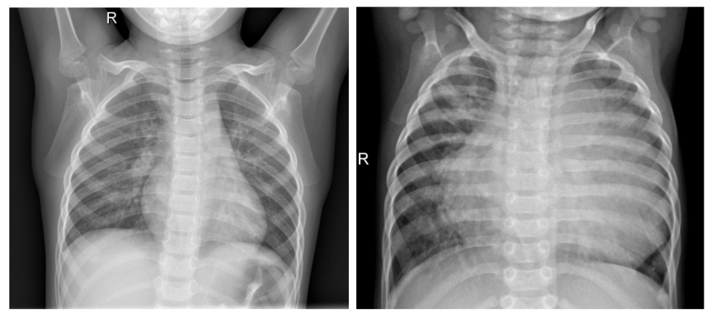
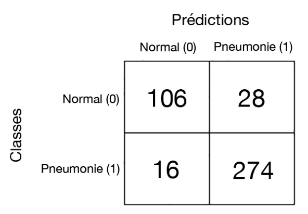

# CHEST_X-RAY_PNEUMONIA_CLASSIFICATION
### 1. Authors and  e-mail contact:
<ul>
    <li>Isaac Neri Gomez Sarmiento (isaacneri.gs@gmail.com)</li>
    <li>Deniz Soysal (deniz-soysal@hotmail.com)</li>
    <li>Stéphane Voyer-Boutet (SVoyer@gmail.com)</li>
    <li>Florian Philippe (florian.philippe.47@gmail.com)</li>
    </ul>
<b>Note:</b> 
 This is our final project for the course Introduction to Machine Learning (GIF-4101) at Laval University, taken in the automn session 2019. Some code for this project was taken from our Homework 4 of the same course. Some parts of the code and/or the results are in French.
  

### 2. Description:
The main goal is to classify if a patient has pneumonia from a X-Ray image of his/her chest using Convolutional Neural Networks (CNN) implemented with the Pytorch library. The dataset was obtained from Kaggle at https://www.kaggle.com/paultimothymooney/chest-xray-pneumonia. 

We used a transfer learning approach because of the following reasons:
<ol>
    <li>Training step doesn't take too much time</li>
    <li>Accuracy is usually higher when using a pre-trained model.</li>
    <li>It's simplier to implement than building a CNN from scratch.</li>
</ol>
We used and compared different architectures to know which best performed on the classification task.  
<ul>
    <li>VGG-16</li>
    <li>ResNet-101</li>
    <li>DenseNet-161</li>
</ul>

We used different image sizes such as:
<ul>
    <li>128x128 px</li>
    <li>256x256 px</li>
    <li>512x512 px</li>
</ul>

We also used different learning rates such as :
<ul>
    <li>0.001</li>
    <li>0.01</li>
    <li>0.1</li>
    <li>1</li>
    <li>10</li>
</ul>

    
### 3. Highlights:
<ul>
    <li>We obtained the best results using ResNet-101, with an image size of 256x256 px and a learning rate of 0.01:</li>
    <ul>
        <li>We got an accuracy for the test set of 89.62%</li>
        <li>We got an accuracy for the training set of 92.31%</li>
        <li>We got an accuracy for the validation set of 83.80%</li>
    </ul>
    <li>The confusion matrix of the test data with the best model is the following:</li> <!--vv [[106, 28], [16, 274]]-->
    
     
    <li> This means that from all 424 chest x-ray images of the test data:</li>
    <ul>
        <li>106 were true negatives (they had no pneumonia and the algorithm classified them correctly)</li>
        <li>274 were true positives (they had pneumonia and the algorithm classified them correctly)</li>
        <li>16 were false negatives (they had pneumonia and the algorithm classified them incorrectly)</li>
        <li>28 were false positives (they had no pneumonia and the algorithm classified them incorrectly)</li>
    </ul>  
</ul>

### 4. Some remarks:

Some further improvements that could be made to this project:
<ul>
    <li>Preprocessing the gray-scale x-ray images maybe by increasing the contrast using histogram equalization or highlighting edges by using a high-pass filter</li>
    <li>Balancing data using a data augmentation approach</li>
    <li>Computing not only accuracy, but also precision, recall and F1-score </li>
    <li> Computing a ROC curve for the different models.</li>
    <li>Saving the best model's weights and biases so we can use it for inference when deploying our model</li>

</ul>
